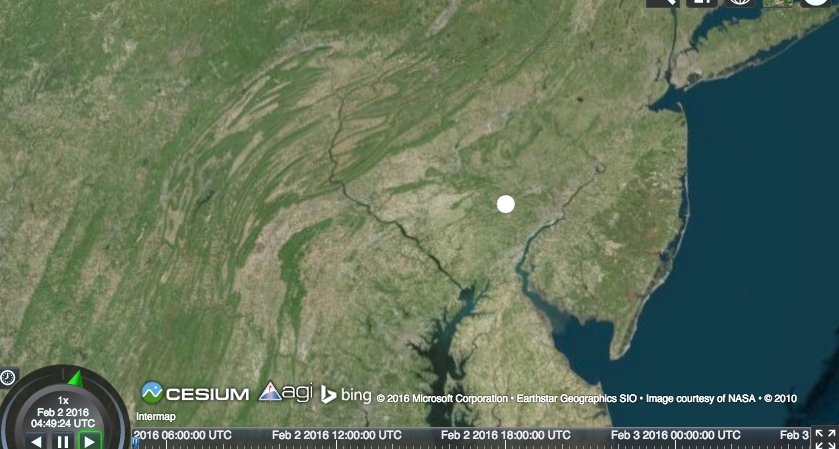

## Getting Started
1. Clone this git repo
2. Host this project on [github](https://github.com)/[bitbucket](https://bitbucket.com)/wherever you like
3. Follow the guideline in this menu
4. Preserver commit history
5. [Email us](mailto:alan.cheung@insightrobotics.com) your cloned repo whenever you are finished/bored

## Guideline
### Task 1
Our [GIS](https://www.wikiwand.com/en/Geographic_information_system) is built upon [cesium](https://cesiumjs.org/index.html), a 3D map engine.

The first task is to use cesium to create a point-of-interest function.

1. Within this repo, cesium-1.17 is included under `./task1/cesium`
2. You may refer [here](https://cesiumjs.org/tutorials/cesium-up-and-running/) for how to setup cesium for local development
3. Create a pin-point on the map upon mouse click
4. Sample output : 

### Task 2
We provide custom imagery to cesium apart from open data-set. Every image is tagged with GPS. Given a zoom level, there exist a formula to convert gps to cesium-recognizable file path (same naming convention as openstreetmap).

1. Write a function taking 3 arguments `zoomlevel`, `latitude`, `longitude`, returning file path of imagery
2. e.g. gps (22.289370, 114.131890) and zoomlevel 18 gives `18/114415/214180`
3. It is up to you to define the format of file path returned as long as it contains `zoomlevel`, `horizontal-index` and `vertical-index`
4. No restriction on programming language
5. The naming conventions for `imagery` and `terrain` data are NOT the same. [This page](https://cesiumjs.org/data-and-assets/terrain/formats/quantized-mesh-1.0.html) is NOT what you need
6. Put your code under `task2` and provide procedures to run your code

### Task 3
General web techniques
1. Issue an ajax request to https://db4.insightglobe.net/career/mail
2. Construct a table from the response
3. Free to use any front end javascript library
4. Put code under `task3`
